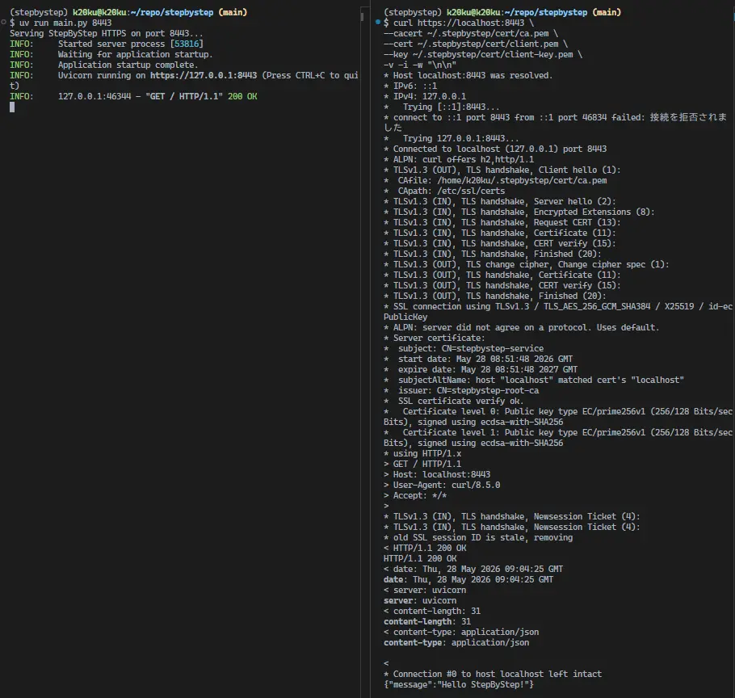

# StepByStep

- mTLS (Mutual TLS) を理解するための実験用リポジトリ。
- 将来的に [Proglog](https://github.com/k20ku/proglog/tree/dev) のような分散サービスで利用されるサービス間認証を理解することを目的としている。
- API サーバー自体は FastAPI + Uvicorn を利用した最小構成とし、主眼はアプリケーションではなく証明書管理と TLS に置いている。

## Features

- Root CA 発行
- Server Certificate 発行
- Client Certificate 発行
- mTLS 通信確認 (`curl`)
- FastAPI による最小 API サーバー

### Generate Certificates

```bash
make gencert
```

- **生成されるディレクトリ**:
        - On your home directory, `.stepbystep/cert/`

- **生成される証明書**:
        - Root CA (at `~/.stepbystep/cert/ca.pem`)
        - Server Certificate (at `~/.stepbystep/cert/server.pem`)
        - Client Certificate (at `~/.stepbystep/cert/server.pem`)

## Setup

```bash
uv venv
source .venv/bin/activate
```

## Run Server

```bash
uv run main.py 8443
```

- **Client**:

```bash
curl https://localhost:8443 \
--cacert ~/.stepbystep/cert/ca.pem \
--cert ~/.stepbystep/cert/client.pem \
--key ~/.stepbystep/cert/client-key.pem \
```

- **Response**:

```bash
{"message":"Hello StepByStep!"}
```

### TLS Verification

詳細な TLS ハンドシェイク確認:

```bash
curl https://localhost:8443 \
--cacert ~/.stepbystep/cert/ca.pem \
--cert ~/.stepbystep/cert/client.pem \
--key ~/.stepbystep/cert/client-key.pem \
-v -i
```



## Motivation

### 経緯

当初は Proglog で利用されている CFSSL を調査していた。
しかし、

- JSON ベースの設定管理がやや煩雑
- Common Name 中心の設計
- メンテナンスが停滞気味

という状況だった。

そのため現在は Smallstep の Step CLI を利用している。

### 選定

- **採用理由**:
        - 現在も活発に開発されている
        - ドキュメントが充実している
        - 将来的に Step CA へ拡張できる
        - CFSSL と近い用途で利用できる

（本プロジェクトでは最終的に PEM ファイルを利用するだけであるため、アプリケーション側へ影響を与えずに置き換えられることも確認した。）

## What I Learned

### mTLS is different from HTTPS

- 通常の HTTPS はサーバー認証のみを行う。
- 一方でmTLS では、
        - サーバーがクライアントを認証
        - クライアントがサーバーを認証

そのため内部サービス間通信やゼロトラスト環境で利用される。

## Certificates are the important part

- CFSSL や Step CLI は証明書を発行するための手段であり、重要なのはPEM 証明書と TLS ハンドシェイクである。
- 実際にクライアント証明書を利用した通信を確認することで、サービス認証の仕組みを理解できた。

## Preparation for Proglog

- この実験は [Proglog 本編](https://github.com/k20ku/proglog/tree/dev) を進める前の事前調査として行った。
- 本編で利用される証明書や TLS の概念を先に理解しておくことで、後続の実装を追いやすくすることを目的としている。
